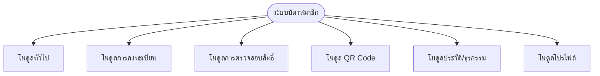
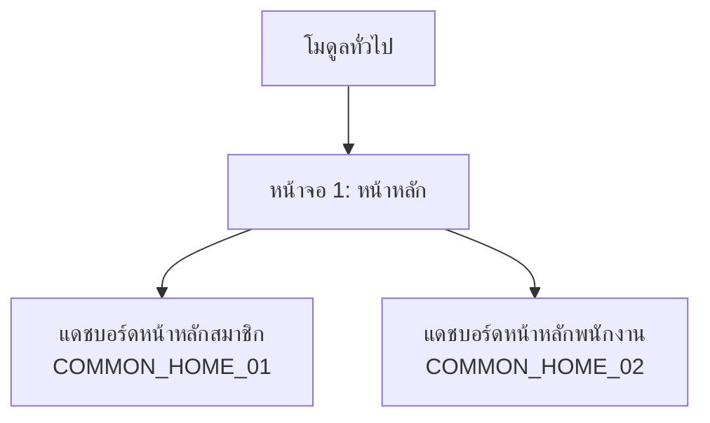
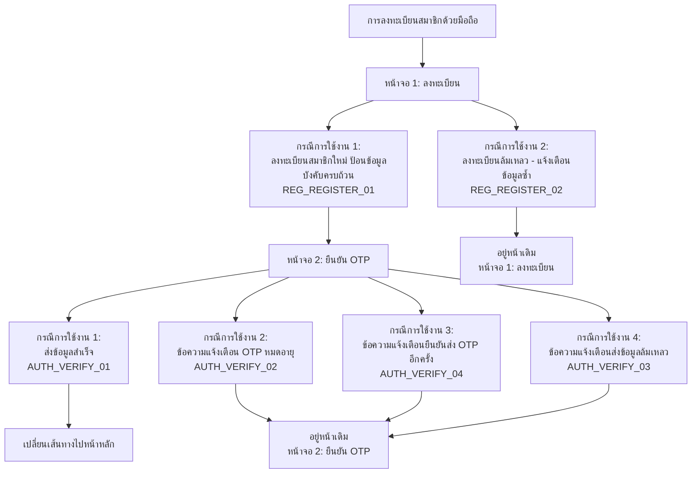
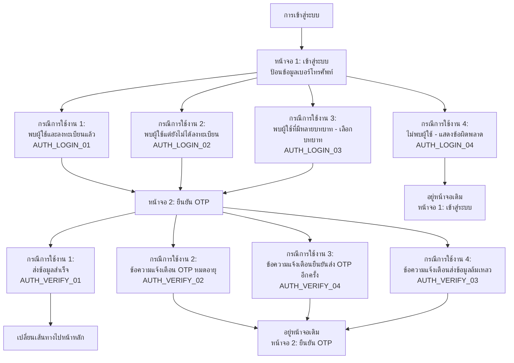
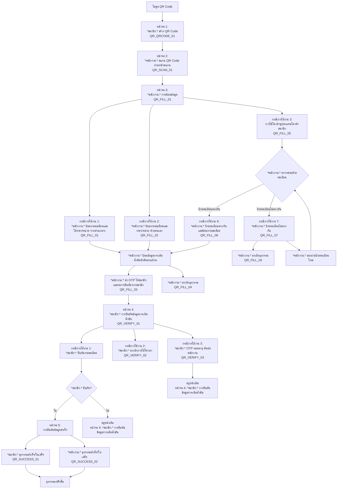
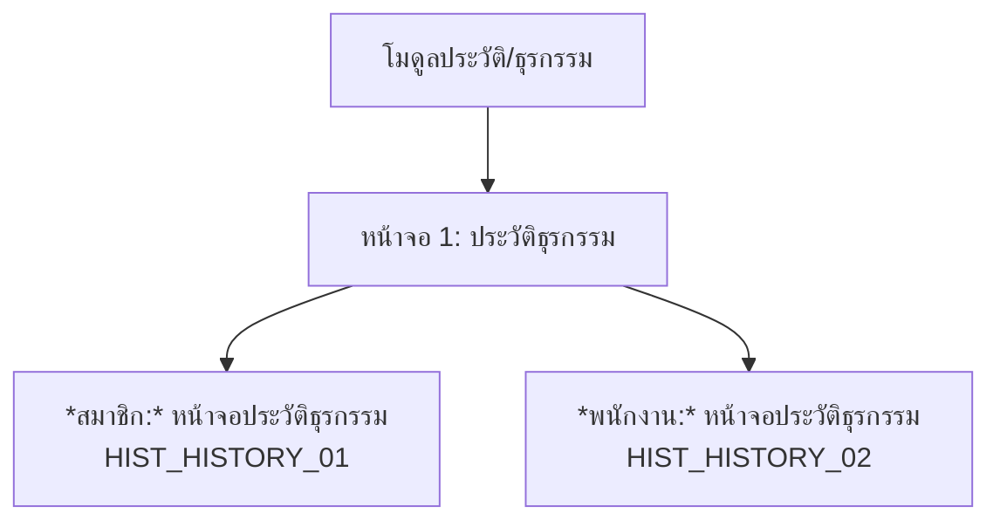
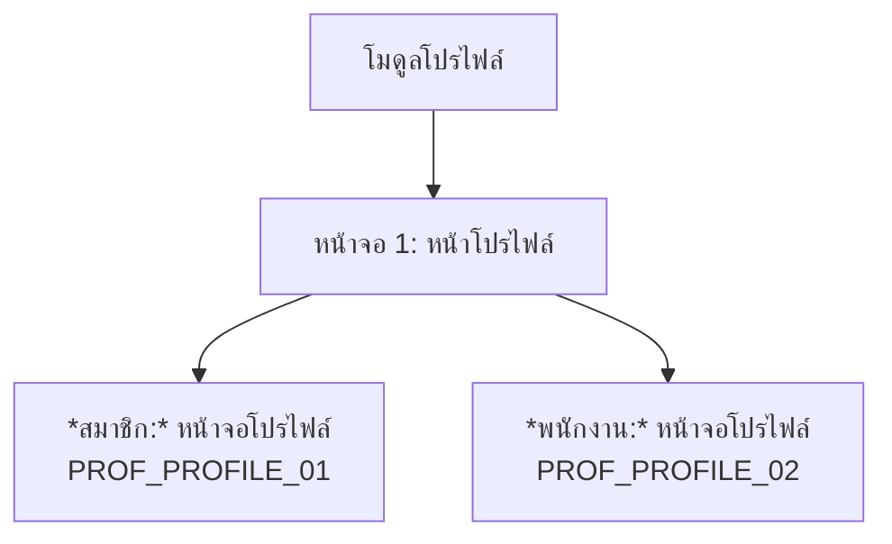
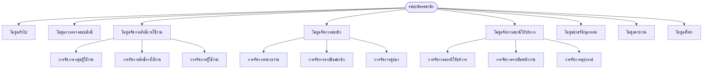
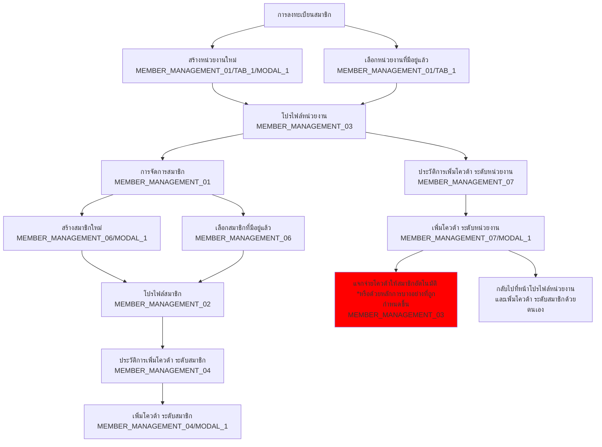
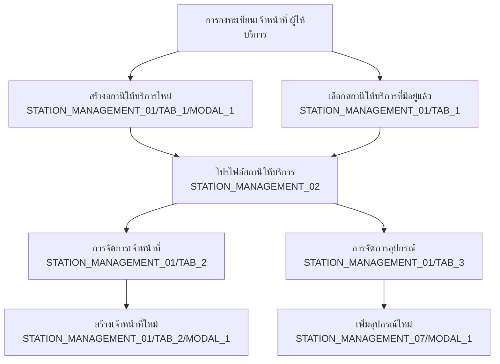

# ระบบบัตรสมาชิก

## การใช้งานบนอุปกรณ์เคลื่อนที่ (มือถือ,แท็บเล็ต)
### โมดูลทั้งหมด

### 1. โมดูลทั่วไป

### 2. การลงทะเบียนสมาชิกด้วยมือถือ (สมาชิกทำด้วยตัวเอง)

### 3. การเข้าสู่ระบบ

### 4. โมดูล QR Code

### 5. โมดูลประวัติ/ธุรกรรม

### 6. โมดูลโปรไฟล์

## การจัดการผ่านเว็บแอพพลิเคชัน
### โมดูลทั้งหมด

### ผู้ดูแลระบบ ลงทะเบียนสมาชิก

### ผู้ดูแลระบบ ลงทะเบียนเจ้าหน้าที่ ผู้ให้บริการ
