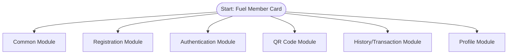
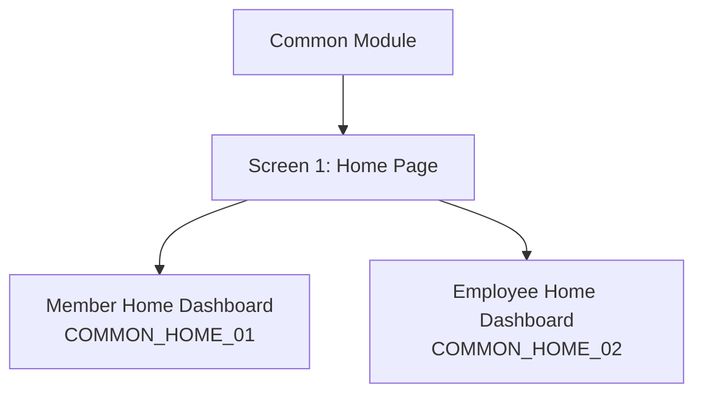
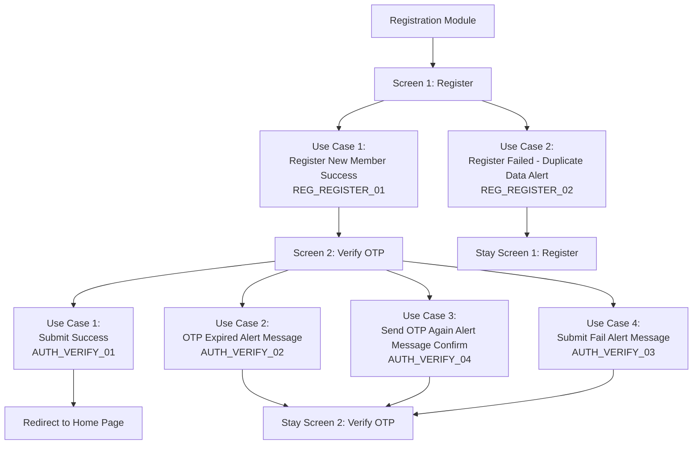
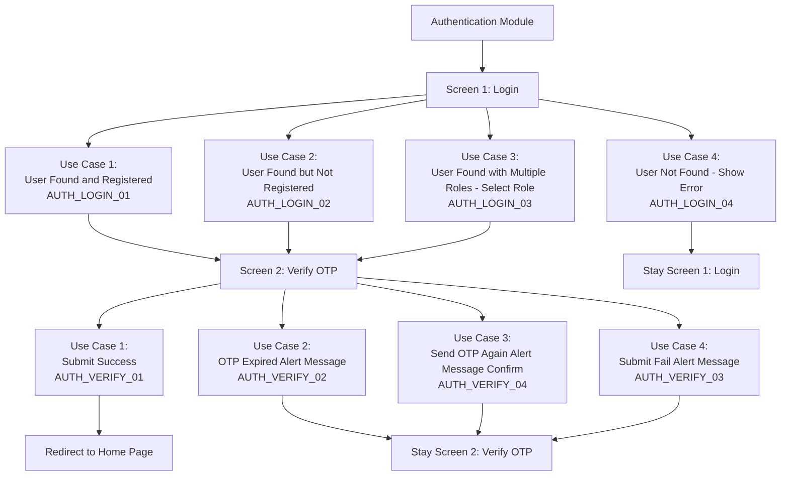
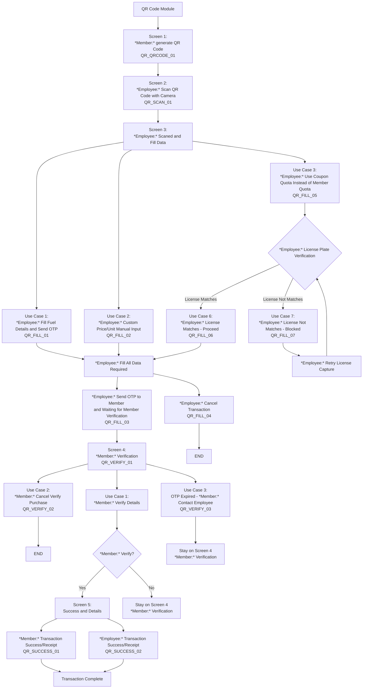
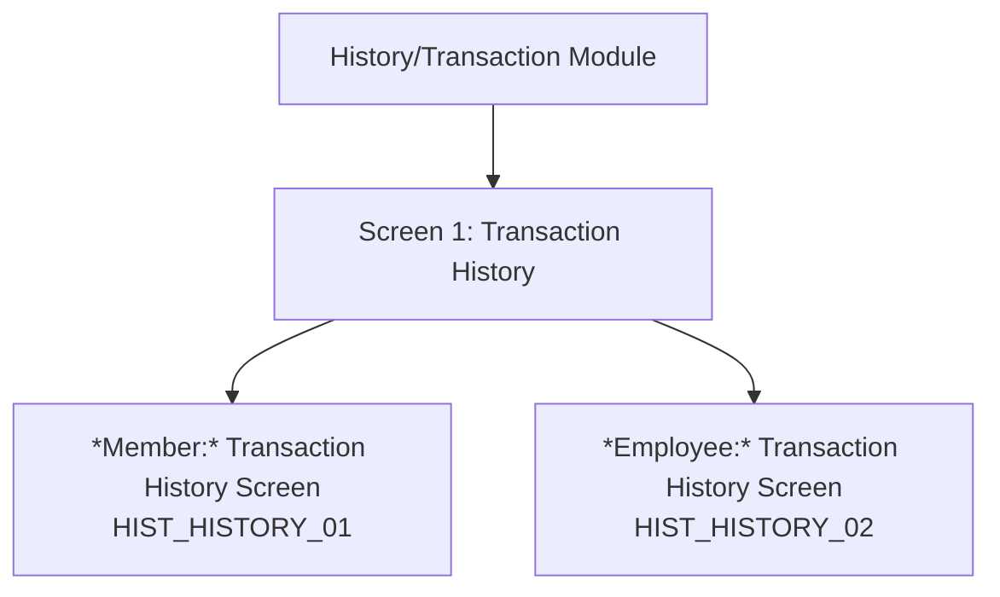
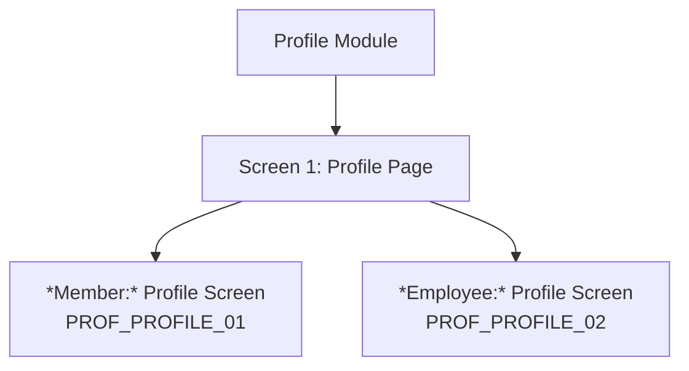

# Fuel Member System - Module/Screen/Use Case Flowchart

This flowchart represents the structure found in mobile_app_ui.html with proper flow direction:
- **Modules**: Top-level organization of system components
- **Screens**: Sequential flow downward (screen1 → screen2 → screen3)
- **Use Cases**: Specific actions or conditions that users perform in each screen - what the user actually does, including decision points for different user roles (Member vs Employee)

## Complete System Flow

## 1. Common Module

## 2. Registration Module

## 3. Authentication Module

## 4. QR Code Module

## 5. History/Transaction Module

## 6. Profile Module

## Summary Statistics

- **Total Modules**: 6 (Common, Registration, Authentication, QR Code, History/Transaction, Profile)
- **Total Screens**: 10
- **Total Use Cases**: 29
- **Member Use Cases**: 15
- **Employee Use Cases**: 13
- **Shared Use Cases**: 1
- **Decision Points**: 26 (diamond shapes)
- **Navigation Items**: 4 (Home, QR Code, History, Profile)

## Screen Reference Map

| Module | Screen | Use Case | Screen ID | User Type |
|--------|------|----------|-----------|-----------|
| Common | 1 | 1 | COMMON_HOME_01 | Member |
| Common | 1 | 2 | COMMON_HOME_02 | Employee |
| Registration | 1 | 1 | REG_REGISTER_01 | Member |
| Registration | 1 | 2 | REG_REGISTER_02 | Member |
| Auth | 1 | 1 | AUTH_LOGIN_01 | Member |
| Auth | 1 | 2 | AUTH_LOGIN_02 | Member |
| Auth | 1 | 3 | AUTH_LOGIN_03 | Member/Employee |
| Auth | 1 | 4 | AUTH_LOGIN_04 | Member |
| Auth | 2 | 1 | AUTH_VERIFY_01 | Member |
| Auth | 2 | 2 | AUTH_VERIFY_02 | Member |
| Auth | 2 | 3 | AUTH_VERIFY_03 | Member |
| Auth | 2 | 4 | AUTH_VERIFY_04 | Member |
| QR | 1 | 1 | QR_QRCODE_01 | Member |
| QR | 2 | 1 | QR_SCAN_01 | Employee |
| QR | 3 | 1 | QR_FILL_01 | Employee |
| QR | 3 | 2 | QR_FILL_02 | Employee |
| QR | 3 | 3 | QR_FILL_03 | Employee |
| QR | 3 | 4 | QR_FILL_04 | Employee |
| QR | 3 | 5 | QR_FILL_05 | Employee |
| QR | 3 | 6 | QR_FILL_06 | Employee |
| QR | 3 | 7 | QR_FILL_07 | Employee |
| QR | 4 | 1 | QR_VERIFY_01 | Member |
| QR | 4 | 2 | QR_VERIFY_02 | Member |
| QR | 4 | 3 | QR_VERIFY_03 | Member |
| QR | 4 | 4 | QR_VERIFY_04 | Member |
| QR | 5 | 1 | QR_SUCCESS_01 | Member |
| QR | 5 | 2 | QR_SUCCESS_02 | Employee |
| History | 1 | 1 | HIST_HISTORY_01 | Member |
| History | 1 | 2 | HIST_HISTORY_02 | Employee |
| Profile | 1 | 1 | PROF_PROFILE_01 | Member |
| Profile | 1 | 2 | PROF_PROFILE_02 | Employee |