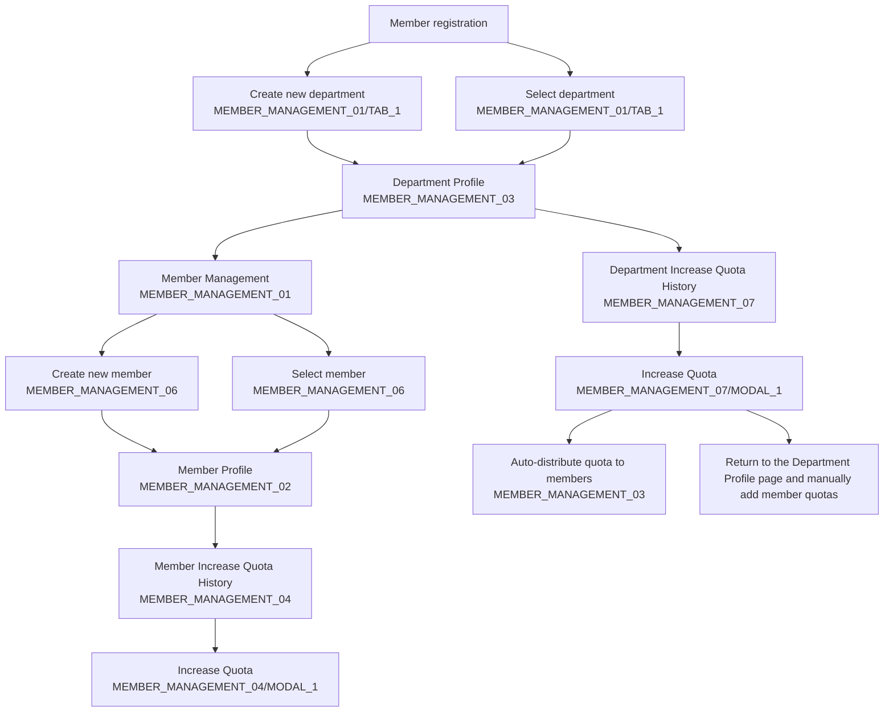

# Admin Register Member Flow Diagram

## English Version

## Screen Reference Mapping

| Screen | Screen Code | Purpose |
|--------|-------------|---------|
| Screen 1: Member Management | MEMBER_MANAGEMENT_01 | Department and Member creation/management dashboard |
| Screen 2: Member Profile Details | MEMBER_MANAGEMENT_02 | Individual member profile view and management |
| Screen 3: Department Details | MEMBER_MANAGEMENT_03 | Department profile view and quota management |
| Screen 4: Increase Quota History | MEMBER_MANAGEMENT_04 | Individual quota increase tracking and management |
| Screen 4: Coupon Quota History | MEMBER_MANAGEMENT_05 | Coupon-based quota increase tracking |

## Process Details

### Main Case Flow:
1. **Department Setup** (if needed)
   - Admin creates new department with company details
   - Sets department type and contact information

2. **Member Creation**
   - Admin creates individual member
   - Links member to department
   - Sets basic member information

3. **Individual Quota Assignment**
   - Admin manually increases quota for specific member
   - Records reason and amount
   - Creates audit trail

### Sub Case Flow:
1. **Department Setup** (if needed)
   - Same as main case

2. **Department Quota Allocation**
   - Admin sets total department quota
   - Defines auto-distribution rules

3. **Auto Top-up Process**
   - System automatically distributes quota to all department members
   - Equal or rule-based distribution
   - Bulk quota assignment

## Business Rules

### Main Case:
- Individual member quota increases require manual approval
- Each quota increase is tracked with full audit trail
- Members must belong to a valid department

### Sub Case:
- Department quota can be distributed automatically
- Auto-allocation rules can be equal split or custom
- New members added to department automatically receive quota share
- Department total quota acts as the master pool