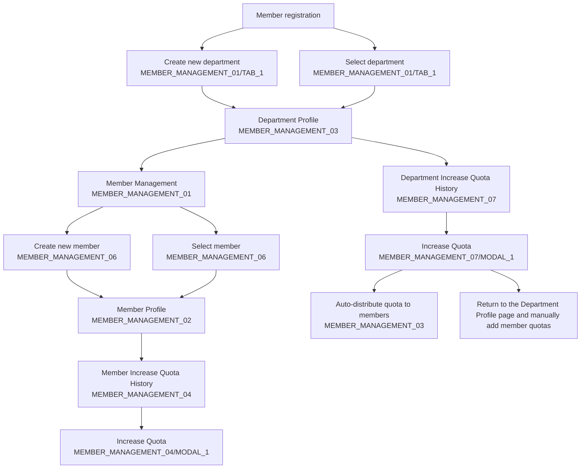

# Admin Register Member Flow Diagram

```mermaid
flowchart TD
    A[Member registration] --> B[Create new department<br/>MEMBER_MANAGEMENT_01/TAB_1]
    A -->C[Select department<br/>MEMBER_MANAGEMENT_01/TAB_1]

    B -->D[Department Profile<br/>MEMBER_MANAGEMENT_03]
    C -->D
    
    D --> E[Member Management<br/>MEMBER_MANAGEMENT_01]
    E --> E1[Create new member<br/>MEMBER_MANAGEMENT_06]
    E --> E2[Select member<br/>MEMBER_MANAGEMENT_06]
    E1 --> F[Member Profile<br/>MEMBER_MANAGEMENT_02]
    E2 --> F
    
    F --> G[Member Increase Quota History<br/>MEMBER_MANAGEMENT_04]
    G --> G1[Increase Quota<br/>MEMBER_MANAGEMENT_04/MODAL_1]
    
    D -->I[Department Increase Quota History<br/>MEMBER_MANAGEMENT_07]
    I --> I1[Increase Quota<br/>MEMBER_MANAGEMENT_07/MODAL_1]
    I1 --> K[Auto-distribute quota to members<br/>MEMBER_MANAGEMENT_03]
    I1 --> K1[Return to the Department Profile page and manually add member quotas]
    
```
